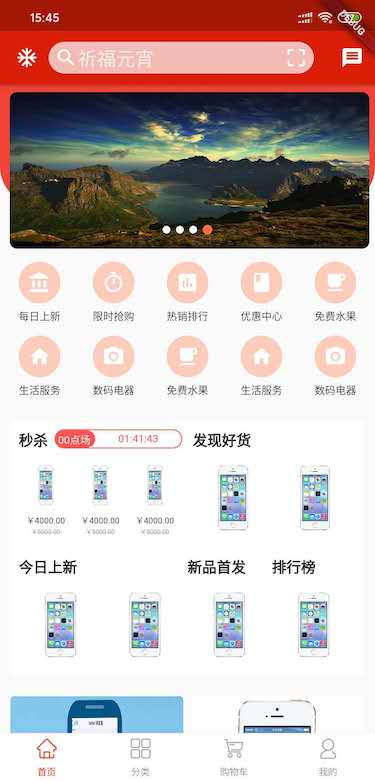
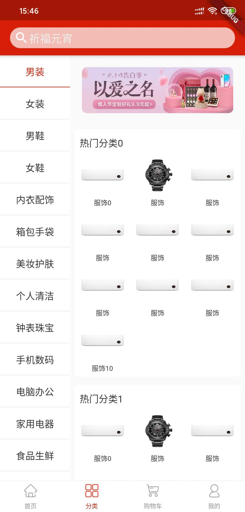

# flutter_mall

练手的一个Flutter电商项目。

使用到的开源库：

```
  # 状态管理
  provider: ^4.0.2
  # 轮播
  flutter_swiper: ^1.1.6
  # 下拉刷新
  flutter_easyrefresh: ^2.0.9
  # 图片缓存
  cached_network_image: ^2.0.0
  # 常用工具类库
  flustars: ^0.2.6+1
  # 路由
  fluro: ^1.5.2
```

截图：




